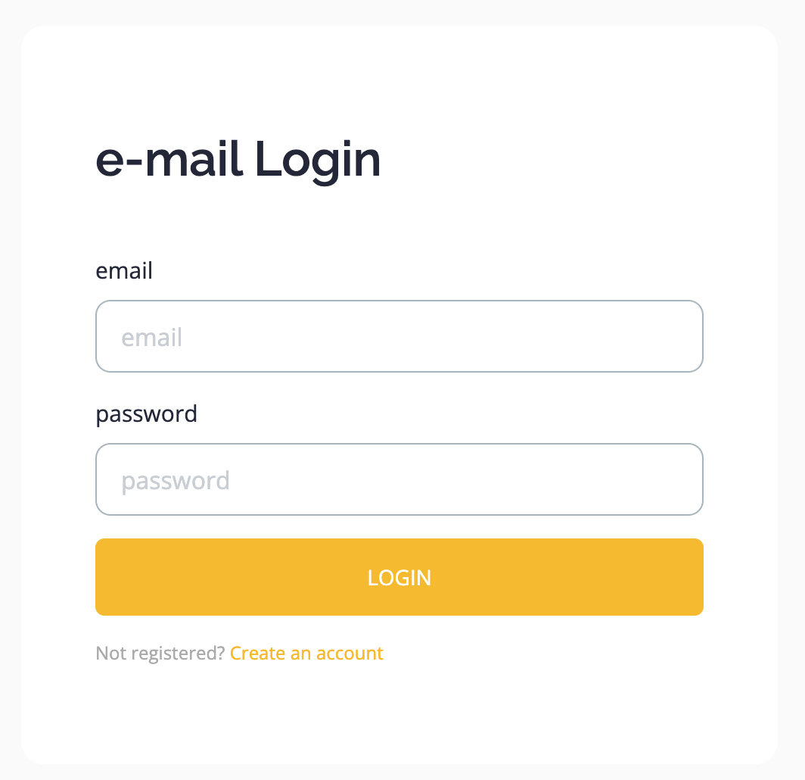
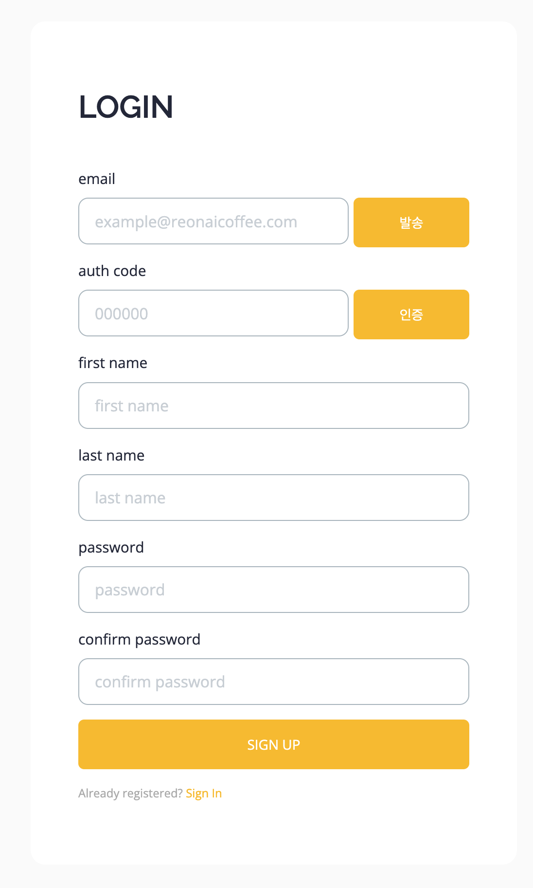

# re-on-site

Version.

```text
> SpringBoot: 3.2.0
> Java: jdk 17
> Gradle
```

```text
> Backend
  - Java
  - Spring Boot
  - Spring Data JPA/REDIS
  - Spring Security
  - Spring OAuth2
> DataBase
  - MariaDB
  - Redis
> DevOps
  - AWS RDS (db.t3.micro)
  - AWS EC2 (t2.micro)
  - AWS Route 53
  - Docker
  - Jenkins
  - Nginx
> Front
  - thymeleaf
  - JavaScript(ES6)
  - CSS
> SSL
  - Certbot
  - Let’s encrypt
> Test
  - Junit
  - mockito
  - REST Assured
```

# System architecture


---

# developing

ing.
- https://flow.team/main.act?detail
- 애플 로그인
- table -> note 대신 t.p, fc, sc 컬럼 만들어서 시간/온도 보여주기
- 서버에서 앱으로 그래프 데이터 조희 API
- [AWS RDS 인증서](https://docs.aws.amazon.com/ko_kr/AmazonRDS/latest/UserGuide/ssl-certificate-rotation-mysql.html)

- Sign In/Sign Up
- Record
- Member -> 회원 정보 수정
- 5xx, 4xx 에러 페이지 만들기
  - https://recruit.kakaobank.com/404
- 로그 관리 -> 날짜별로 덮어쓰기
- 도메인 등록
  - [Google Search Console 등록](https://search.google.com/search-console/about)

Study.
- [주문 API 개발로 알아보는 TDD ](https://github.com/jihunparkme/Study-project-spring-java/tree/main/product-order-service)

  ```text
  final keyword
  record class
  Assert in constructor
  rest-assured api test
  var type
  HttpStatus
    200 OK
    201 CREATE
  ```


# Domain

## Main

**Main.** (`/`)
- [ ] 소개

## Notice

**Notice.** (`/notice`)
- [ ] All permit
- [ ] 공지사항 기본 기능
  - 목록 / 조회 / 수정 / 삭제(삭제 flag)
- [ ] 관리자만 작성/수정/삭제 버튼 노출 및 권한 예외 처리
- [ ] 기본 회원은 조회만 가능

## News Letter

**News Letter** (`/new-letter`)
- [ ] 뉴스레터 기본 기능
  - 목록 / 조회 / 수정 / 삭제(삭제 flag)
- [ ] 관리자만 작성/수정/삭제 버튼 노출 및 권한 예외 처리
- [ ] 기본 회원은 조회만 가능

## Contact us

**Contact us** (`/contact`)
- [ ] 관리자 메일로 문의 내용 발송

## Voice

**Voice** (`/voice`)
- [ ] 고객의 소리 기본 기능
  - 목록 / 조회 / 수정 / 삭제(삭제 flag)
- [ ] 로그인 사용자만 작성 가능
- [ ] 수정/삭제 시 작성자와 요청자 검증 필요
- [ ] 작성/수정 완료 시 관리자 메일로 알림

## Sign In/Sign Up

**Sign In/Sign Up**


<p align="center" width="100%">
    
    
</p>

- 소셜(카카오, 구글, 애플) 계정
- 이메일 계정
  - 이메일 가입 시 인증번호 발송 및 검증
  - 인증번호 및 인증 상태는 Redis 에서 관리
- 세션은 spring-session-data-redis 활용
- 로그인 / 로그아웃 / 개인정보 수정 / 탈퇴

- [ ] 소셜 로그인
  - [x] 카카오 로그인
  - [x] 구글 로그인 (앱 게시 필요)
  - [ ] 애플 로그인
  - 연결 끊기
    - [ ] 카카오: https://developers.kakao.com/docs/latest/ko/kakaologin/rest-api#unlink
    - [ ] 구글: 
    - [ ] 애플: 
  - 작업 끝나면 상용 적용
  
- [ ] 이메일로 가입하기
  - [x] 탈퇴 
  - [ ] 비밀번호 찾기 (메일로 비밀번호 변경 링크 전달)
  - [ ] 이메일 찾기

## Member


- [x] 회원 정보 조회 및 수정
  - [x] 소셜 로그인이면 소설 마크 노출
  - [x] 이메일 가입자만 First name 변경 가능
- [ ] 비밀번호 변경은 별도 페이지에서 관리
- [ ] 회원탈퇴

## Record

**Record List**


**Record View**


- [x] 로스팅 로그 조회
- [x] [amcharts](https://www.amcharts.com/) 적용
  - [Highlighting Line Chart](https://www.amcharts.com/demos/highlighting-line-chart-series-on-legend-hover/)
- [ ] 회원은 자신의 로그만 조회 가능, 관리자는 모든 로그 조회 가능
- [ ] 회원번호, S/N, 날짜로 검색
- [x] 프로파일 레시피
  - [AG Grid](https://www.ag-grid.com/)
  - [AG Grid javascript Doc.](https://www.ag-grid.com/javascript-data-grid/getting-started/)

.

## Admin

**management** (`/management`)

**Statistics** (`/management/statistics`)
- [ ] 가입자(개인/기업), 지역, 로스팅 횟수 등 통계 정보

**Users**  (`/management/members`)
- [ ] 회원 정보 관리
- [ ] 조회, 생성, 수정-삭제

**Product**  (`/management/product`)
- [ ] 상태, 상품코드, S/N, 버전 관리

.

## Test.

- JaCoCo > 테코드 커버리지

## Monitoring

- [ ] Prometheus
- [ ] Grafana
- [ ] 로그 파일 생성 규칙

.

## TODO

- [ ] 레시피 공유(레시피 업로드, 다운로드)
  - 로스팅 로그 페이지에서 공유하기 누르고, 글 작성을 하면 로스팅 공유 페이지로 등록
  - 글쓰기(ckeditor) 기능
    - https://ckeditor.com/
    - https://ckeditor.com/ckeditor-5/download/
- [ ] 레시피 명예의 전당
- [ ] amcharts.com 결제

## Refactor

- [ ] 미사용 파일 제거
  - [ ] img
  - [ ] vendor
- [ ] 미서용 코드 제거
  - [ ] style.css
  - [ ] main.js