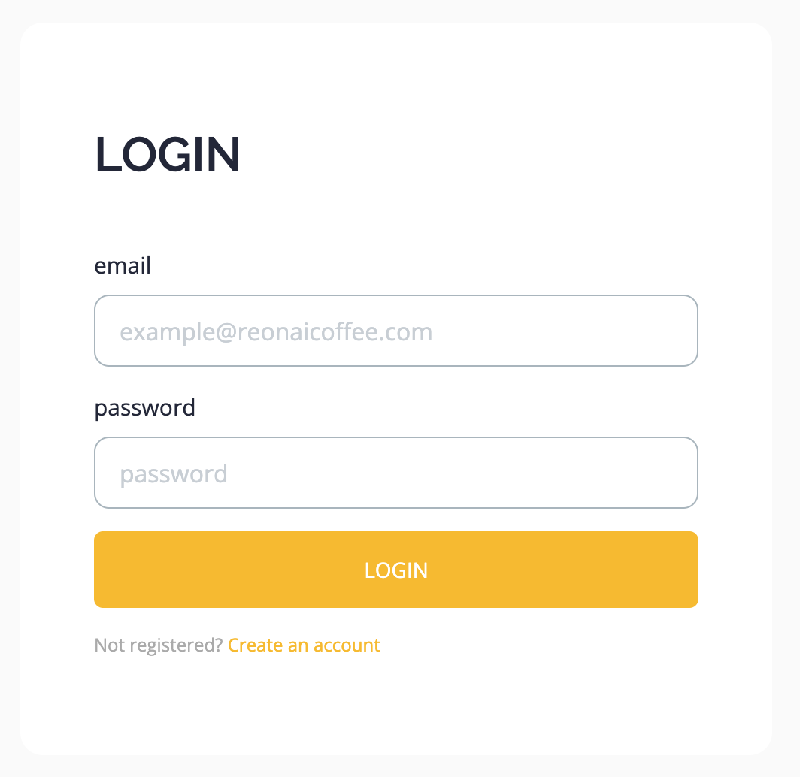
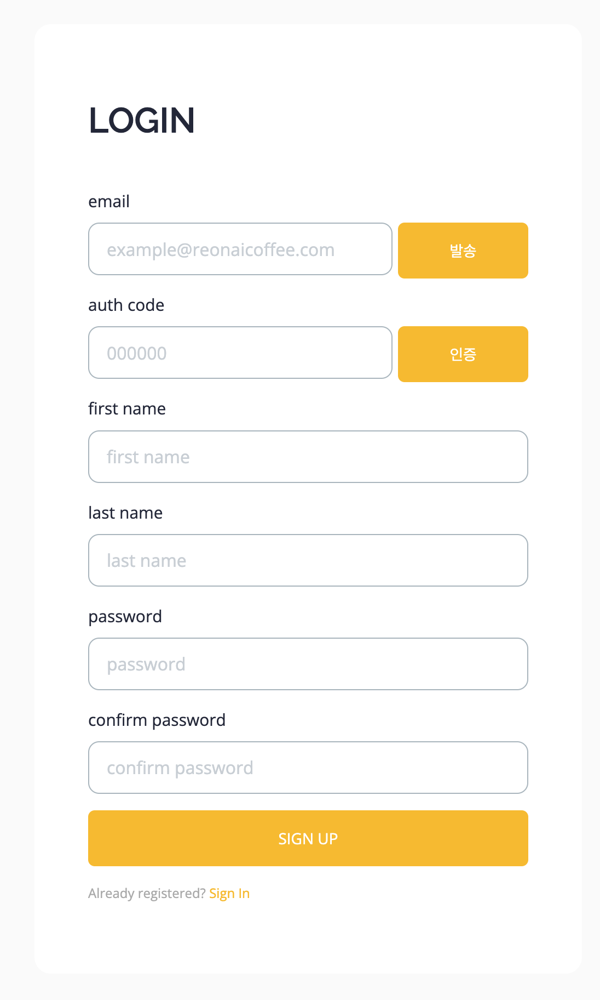

# REON

로스팅 프로파일 분석 및 공유 사이트입니다.

평소 관심있고, 프로젝트에 적용해 보고 싶었던 기술을 적용해 보았습니다.

- `AWS EC2/RDS`, `Docker` 기반 인프라 구축, `Spring Security`, `OAuth 2.0`, `JPA`, `Redis` 등..

## Development Stack

```bash
├── Backend
│   ├── Java JDK 17
│   ├── Spring Boot 3.2.0
│   ├── Spring Web MVC
│   ├── Spring Data JPA/REDIS
│   ├── Spring Security
│   ├── Spring OAuth2
│   ├── Spring WebFlux
│   └── Gradle 8.3
├── DataBase
│   ├── MariaDB
│   └── Redis
├── DevOps
│   ├── AWS RDS (db.t3.micro)
│   ├── AWS EC2 (t2.micro)
│   ├── AWS Route 53
│   ├── Docker
│   ├── Jenkins
│   └── Nginx
├── Front
│   ├── thymeleaf
│   ├── JavaScript(ES6)
│   └── CSS
├── SSL
│   ├──Certbot
│   └──Let’s encrypt
├── TEST
│   ├──Junit 5
│   ├──mockito
│   ├──REST Assured
│   └──Coverage(JaCoCo)
```

## System architecture


## 주요 기능

### 로그인

- Social(KAKAO, GOOGLE, APPLE) Login
- Email Login
  - [ ] 비밀번호 찾기(메일로 비밀번호 변경 링크 전달)
  - [ ] 이메일 찾기


**• 세션 관리**

- `spring-session-data-redis`

**• 회원가입**

- 이메일
  - 인증번호 발송 및 검증
  - 인증번호 및 인증 상태는 Redis 에서 관리
- 소셜(Kakao, Google, Apple)
  - Oauth2 Login API

**• 로그아웃**


## Page

### Login


**Login Main Page**


**Email Login/Sign Up Page**

<p align="center" width="100%">
    
    
</p>

## Mypage

### View


### Function

**• 회원 정보 조회**

- 소셜 로그인이면 소설 마크 노출

**• 회원 정보 수정**
- [ ] 비밀번호 변경

**• 회원 탈퇴**

- 이메일 계정
  - 회원정보 삭제
- 소셜 계정
  - [kakaologin unlink API](https://developers.kakao.com/docs/latest/ko/kakaologin/rest-api#unlink)
  - Google revoke token
  - [ ] Apple revoke token

```text
Apple revoke token Ref.

- https://oozoowos.tistory.com/entry/Spring-Boot-Security-%EC%97%86%EC%9D%B4-OAuth2%EB%A1%9C-Google-%EB%A1%9C%EA%B7%B8%EC%9D%B8-%EA%B5%AC%ED%98%84-%EC%9C%A0%EC%A0%80-%EC%A0%95%EB%B3%B4-%EC%96%BB%EA%B8%B0
- https://velog.io/@givepro91/jjo2cyus
- https://whitepaek.tistory.com/61
```

## Record

### View

**Record List**


**Record View**


### Function

**• 로스팅 로그 조회**

- 자신의 저장한 로그만 조회 가능
- Roasting Record Graph
  - [amcharts](https://www.amcharts.com/)
- Profile Recipe
  - [AG Grid](https://www.ag-grid.com/)
  - [AG Grid javascript Doc.](https://www.ag-grid.com/javascript-data-grid/getting-started/)
- [ ] 날짜, 로그 제목으로 검색


## Admin

**• Records**
- 저장된 모든 로스팅 로그 조회

**• Products**
- 제품 리스트 조회
- 제품 상세 정보 조회/수정/삭제
- S/N 생성
- S/N 등록

**• Statistics**
- [ ] 가입자(개인/기업), 지역, 로스팅 횟수 등 통계 정보

**• Members**
- [ ] 회원 정보 관리
- [ ] 조회, 생성, 수정-삭제

# TODD

## Notice

**Notice.** (`/notice`)
- [ ] All permit
- [ ] 공지사항 기본 기능
  - 목록 / 조회 / 수정 / 삭제(삭제 flag)
- [ ] 관리자만 작성/수정/삭제 버튼 노출 및 권한 예외 처리
- [ ] 기본 회원은 조회만 가능

## News Letter

**News Letter** (`/new-letter`)
- [ ] 뉴스레터 기본 기능
  - 목록 / 조회 / 수정 / 삭제(삭제 flag)
- [ ] 관리자만 작성/수정/삭제 버튼 노출 및 권한 예외 처리
- [ ] 기본 회원은 조회만 가능

## Contact us

**Contact us** (`/contact`)
- [ ] 관리자 메일로 문의 내용 발송

## Voice

**Voice** (`/voice`)
- [ ] 고객의 소리 기본 기능
  - 목록 / 조회 / 수정 / 삭제(삭제 flag)
- [ ] 로그인 사용자만 작성 가능
- [ ] 수정/삭제 시 작성자와 요청자 검증 필요
- [ ] 작성/수정 완료 시 관리자 메일로 알림

.

## Monitoring

- [ ] Prometheus
- [ ] Grafana
- [ ] 로그 파일 생성 규칙

## TOBE

- [ ] 레시피 공유(레시피 업로드, 다운로드)
  - 로스팅 로그 페이지에서 공유하기 누르고, 글 작성을 하면 로스팅 공유 페이지로 등록
  - 글쓰기(ckeditor) 기능
    - https://ckeditor.com/
    - https://ckeditor.com/ckeditor-5/download/
- [ ] 레시피 명예의 전당
- [ ] amcharts.com 결제
- 로그 관리 -> 날짜별로 덮어쓰기

## Refactor

- [ ] 미사용 파일 제거
  - [ ] img
  - [ ] vendor
- [ ] 미서용 코드 제거
  - [ ] style.css
  - [ ] main.js

# Domain

**Records**


**Members**


**Products**


---

## Reference

Guide.

```text
JAVA
- final keyword
- record class
- Assert in constructor
- rest-assured api test
- var type
  
REST API 
- 동사 보다는 복수 명사 사용
  - GET /dogs, POST /dogs/{puppy}/owner/{terry}
- GET /dogs (목록 조회)
- GET /dogs/1 (1번 개체 조회)
- POST /dogs (개체 생성)
- PUT /dogs/1 (1번 개체 수정)
- DELETE /dogs/1 (1번 개체 삭제)

DDD
- 도메인에서 비즈니스 로직 처리 + VO 활용하기
- 한 Aggregate에서 다른 Aggregate의 참조는 식별자(id)를 통해서만 참조
- 하나의 Transaction에서 여러 개의 Aggregate이 갱신되어야 하는 경우, 다른 Aggregate 갱신은 비동기 통신을 활용해서 결과적 일관성 맞추기
- Domain Event: 비지니스 도메인에서 일어난 이벤트를 설명하는 메시지(`'과거형'`으로 명명)
- 공통 에러 코드 관리

JPA
- @JoinColumn
- @Index
- @UniqueConstraint
```
- [주문 API 개발로 알아보는 TDD](https://github.com/jihunparkme/Study-project-spring-java/tree/main/product-order-service)
- [Microservice 내부 아키텍처와 EventStorming 설계 - DDD](https://jihunparkme.gitbook.io/docs/lecture/msa/ddd)